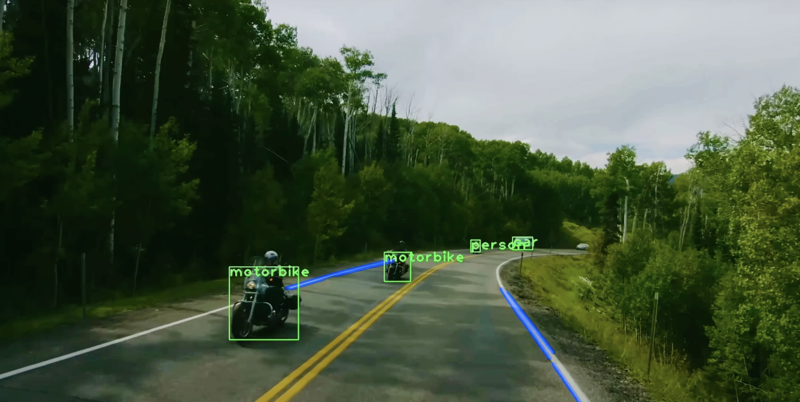
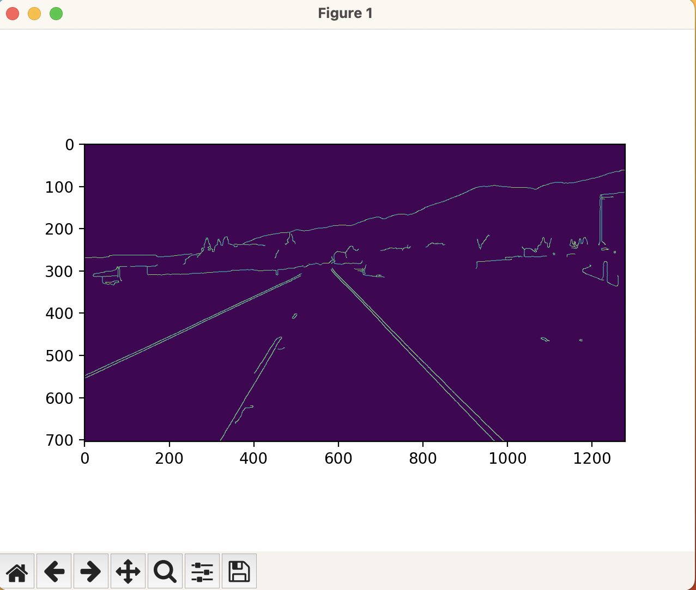

# Advanced Lane and Object Detection System

Welcome to my project repository where I explore advanced computer vision techniques to develop an integrated lane and object detection system. This project leverages the power of the OpenCV library and the YOLO (You Only Look Once) object detection model to identify and visualize driving lanes and objects in real-time video feeds.

## Project Overview

This system combines two crucial aspects of autonomous driving technologies:
1. **Lane Detection**: Detects driving lanes using image processing techniques.
2. **Object Detection**: Identifies objects in real-time using the YOLOv3 model pre-trained on the COCO dataset.

The goal is to create a robust tool that can aid in the development of autonomous driving systems by providing real-time navigational assistance through lane and object recognition.

## Features

- **Real-Time Lane Detection**: Utilizes Canny edge detection and Hough Transform to detect and highlight lanes on the road.
- **Object Detection with YOLOv3**: Leverages deep learning to detect objects with high accuracy using a pre-trained YOLOv3 model.
- **Curvature and Vehicle Offset Calculation**: Calculates the curvature of detected lanes and the vehicle's position relative to lane center, essential for autonomous navigation.
- **Performance Metrics**: Measures and displays the frame processing time and frames per second (FPS), providing insights into the system's performance.

## Technologies Used

- **Python**: All back-end code is written in Python 3.8, making use of its rich ecosystem of libraries.
- **OpenCV (cv2)**: Used for all image processing operations including video capture, filters, and drawing utilities.
- **NumPy**: Handles all array operations and mathematical computations efficiently.
- **YOLOv3 and COCO Names**: Implements object detection with a state-of-the-art pre-trained model.
- **Matplotlib**: Although primarily for plotting, used here for any potential image display and manipulation outside the main processing pipeline.

## Getting Started

To run this project locally, follow these steps:

### Prerequisites

- Python 3.8 or above
- OpenCV library
- NumPy
- Matplotlib (optional for additional visualization)

### Installation

1. Clone the repository:
   ```sh
   git clone https://github.com/aaryamanz/lanedetection-v1
   ```
2. Install the required packages:
   ```sh
   pip install opencv-python-headless numpy matplotlib
   ```

### Usage

To start the detection system, run the script from your command line:

```sh
python lanes.py
```

Make sure to replace `lanes.py` with the actual path to the Python script if not running from the script's directory.

## Example Output

Here's what you can expect from a typical run of the system and how things were processed:






## License

Distributed under the MIT License. See `LICENSE` for more information.

## Contact

Aaryaman Singh - [@aaryamanz](https://www.linkedin.com/in/aaryamansingh/) - aaryaman.singh@mail.utoronto.ca

Project Link: [https://github.com/aaryamanz/lanedetection-v1](hhttps://github.com/aaryamanz/lanedetection-v1)